## UE-Roguelike - ИДЗ по игровой разработке

 

[Информацифя о работе](#информация-о-работе)

[Выполненные задачи](#выполненные-задачи)

[Алгоритм процедурной генерации](#алгоритм-процедурной-генерации)

[Особенности баффов и дебаффов](#особенности-баффов-и-дебаффов)

[Референсы](#референсы)

 

### Информация о работе

- Предмет: Разработка игр на движке **Unreal Engine 5** 
- Студент: Громов Роман Сергеевич, 3 курс ПИ, БПИ-222
- Движок: Unreal Engine 5.4.4
- Язык программирования: BluePrints (C++)
- Ассеты: default + Stylized Animated Lava Material Pack

 

### Выполненные задачи

1. ✅
2. 
3. 
4. 
5. 
6. 
7. 
8. 
9. 
10. 
11. 
12. 
13. 

 

### Алгоритм процедурной генерации

1. В основе процедурной генерации комнат лежат 3 основных актора: BP_Dungeon_Generator, BP_Dungeon_With_Walls и BP_End_Wall
    - `BP_Dungeon_Generator` - актор, который рондомно в последовательном режиме генерирует комнаты (BP_Dungeon_With_Walls), а после этого расставляет закрывающие стены (BP_End_Wall)
    - `BP_Dungeon_With_Walls` - актор, представляющий из себя данж, состоящий из стен, пола, потолка, а также 1 входа и 3 выходов
    - `BP_End_Wall` - актор, представляющий из себя закрывающую стену

2. Основные события актора BP_Dungeon_Generator:
    - `EventBeginPlay` - Выполняет простую цепочку действий: создает базовые виджеты (здоровье + эффекты), вызывает событие SpawnStartRoom и SpawnStartRoom
        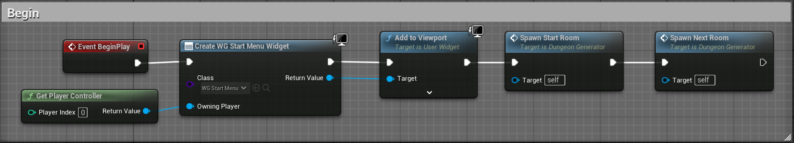

    - `SpawnStartRoom` - Спавнит самую первую комнату, в которой далее появится игрок, а также добавляет в массив ExitsList свободные выходы у комнаты
        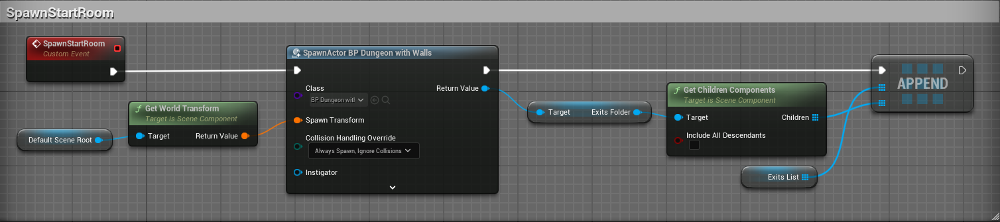

    - `SpawnNextRoom` - Рандомно выбирает свободный выход у комнат (Component Object Reference), присваивает его переменной SelectedExitPoint, а далее берет от этой переменной Scene компоненты GetWorldLocation и GetWorldRotation, которые далее будут участвовать в спавне новой комнаты через SpawnActorFromClass. После спавна новой комнаты, скрипт добавляет эту комнату в список комнат, устанавливает небольшую задержку и вызывает событие проверки наслоения комнат CheckForOverlap.
        
        

    - `AddOverlappingRoomsToList` - Проверяет все те комнаты, при генерации которых может получиться наслоение overlapBox'ов на нашу комнату. Если такие комнаты встречаются в мире, то они добавляются в OverlappedList
        
    - `CheckForOverlap` - После генерации каждой новой комнаты вызывается это событие. В начале оно вызывает событие AddOverlappingRoomsToList. Если после этого события OverlappedList НЕпустой (он содержит объекты тех комнат, которые наслаиваются на нашу), то мы удаляем текущий объект комнаты и переходим к последующей генерации комнат. При этом счетчик комнат у нас не меняется, из-за того, что произошла overlapped генерация. Если же overlappов нет, то мы очищаем OverlappedList, уменьшаем счетчик комнат, удаляем использованный выход и переходм к следующей стадии. Если счетчик комнат не обнулился, то мы генерируем следующую комнату, а если обнулился, то мы генерируем финальный объект BP_Carriage, который означает успешное прохождение игры.
        
        
    - `CloseHoles` - Событие, вызывающееся в конце процедурной генерации. При нем парсится ExitsList и на места невидимых стрелок выхода расставляются закрывающие стены. Это сделано ддя того, чтобы игрок не вываливался за пределы сгенерированной локации
        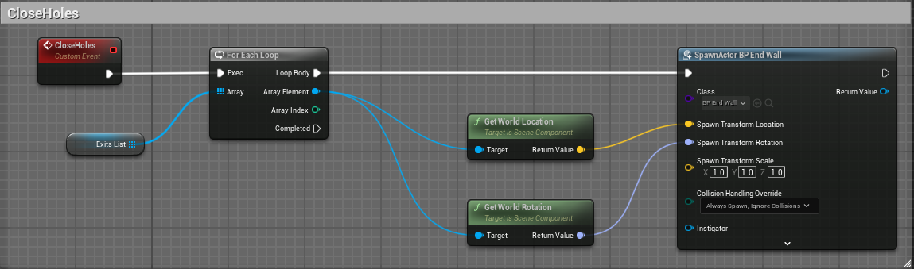

3. Особенности процедурной генерации:
    - У комнаты есть один вход и 3 выхода (количество выходов увеличино с 2 до 3 для более красивой генерации комнат)
    - Процедурная генерация рандомно генерирует лабиринт из комнат таким образом, чтобы из любой комнаты существовал как минимум один путь в любую другую комнату. 
    - Вернуться обратно в комнату можно (это связано с особенностью процедурной генерации)
    - Количество комнат - рандомное значение от 6 до 10

4. Особенности комнат в игре:
    - Всего в игре существует 3 типа комнат: Easy, Medium, Hard
    - У каждого типа свои параметры генерации статических, динамических ловушек, баффов, дебаффов и т.п.
    - Easy комната:
        
        
    - Medium комната:
        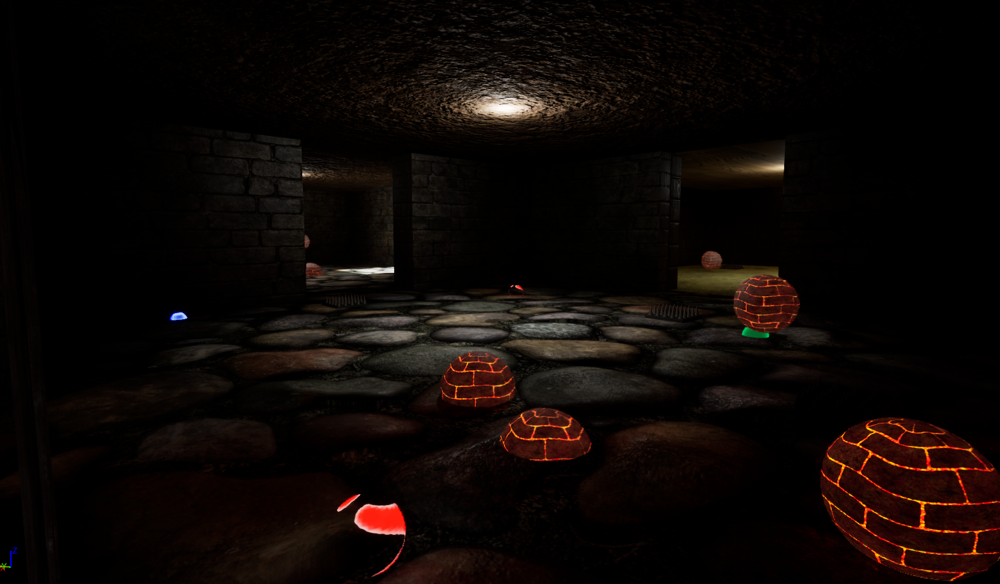

    - Hard комната:
        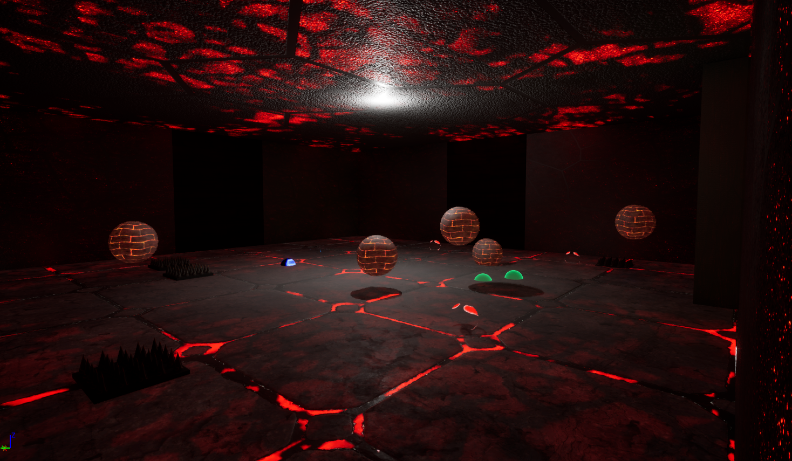

    - Параметры генерации прописаны в DT_Data_Values.
        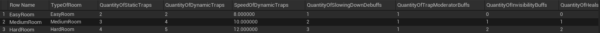

    - Параметры генерации:
        - Количество статических ловушек
        - Количество динамических ловушек
        - Количество невидимых баффов
        - Количество баффов, замедляющих скорость динамических ловушек
        - Количество хила
        - Количество дебаффов, замедляющих игрока
        - Скосроть динамических ловушек
 

### Особенности ловушек

1. В игре представлены 2 основных типа ловушек: статические и динамические

2. Статические ловушки рандомно генерируются на карте и остаются неподвижными до конца игры
    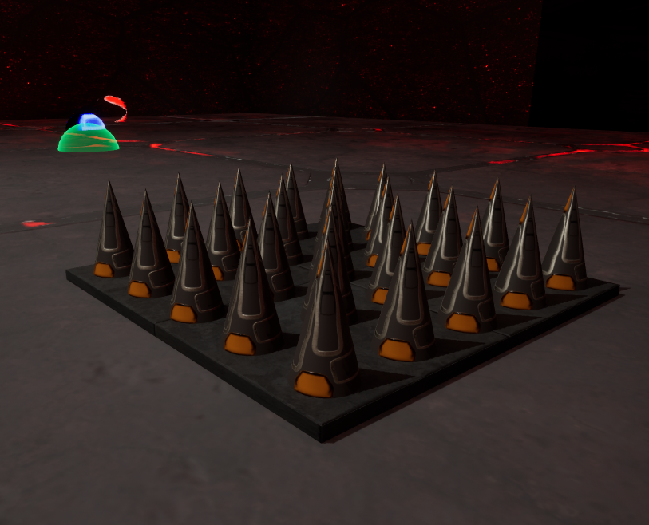

3. Динамические ловушки также рандомно генерируются по всей комнате, но при этом движутся от одной точки к другой и т.д.
    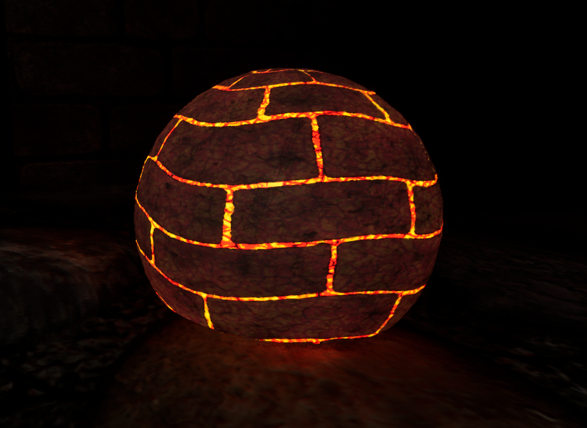

4. Механика передвижения динамических ловушек: при каждом событии EventTick свое положение меняют все динамические ловушки, сгенерированные в комнате. При генерации этих ловушек в blueprint добавляется системная структура DynamicTrapsPosition, которая содержит поля StartValue, CurrentValue и FinishValue. При передвижении этих ловушек у этих структур меняется параметр CurrentValue. При достижении нужного значения, параметры StartValue и FinishValue меняются своими местами, тем самым создавая эффект движения то в одну, то в другую сторону
    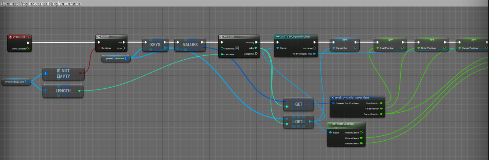
    
    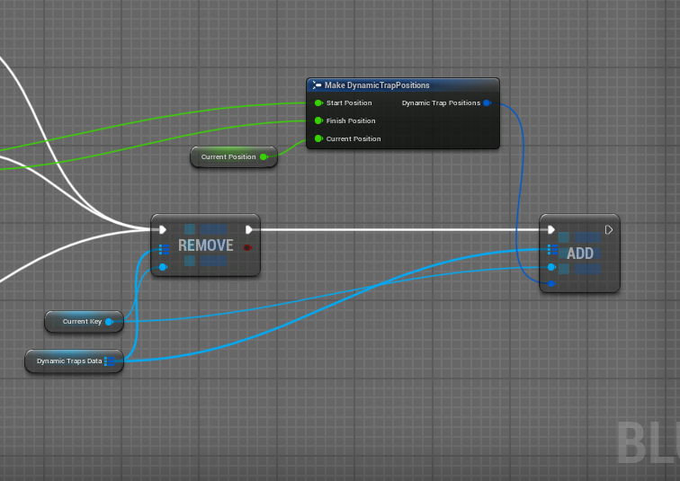

 

### Особенности баффов и дебаффов

1. Дебафф, замедляющий игрока

2. Бафф, замедляющий динамические ловушки

3. Бафф, позваляющий игроку быть невидимым для статических ловушек
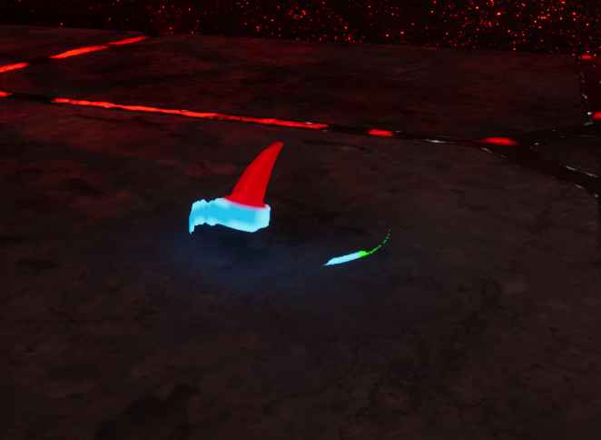

4. Хилка (капуста) - восстанавливает здоровье игроку

5. Цилиндр, означающий конец игры

 

### Референсы

 